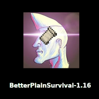

# BetterPlainSurvival-1.16

This is a **modpack** (installer) for Minecraft 1.16 designed to archieve a more convenient playing experience **without changing any vanilla behaviour**: This modpack is *entirely client-sided*. It should be *almost multiplayer proof* ([FVT-fabric](https://github.com/Flourick/FVT-fabric) is the only concern as it has built-in 'hacking' features like freecam that are forbidden on most mutliplayer servers).

BetterPlainSurvival-1.16 uses [Fabric](https://fabricmc.net/) as its mod loder and some its + addidional librarys.

## Why does this exist?

You may point out the fact that there is a already a popular website ([curseforge](https://www.curseforge.com/)), that already has over 70k minecraft mods - and even modpacks - on it; so why should you make a modpack on github? But as curseforge was bought by amazon it wants me to download their stupid launcher to even create a modpack. They are really so much against user freedom, that they literally invest in making their website webscraping-proof. This is a pain I don't have to deal with, and so I made a modpack + installer in less than 20 SLOC shell script directly on github, where most of these mods already are anyway.

I would hope more people in the modding scene would also do something against this current state of affairs. But they seem to be more concerned about wasting their time playing video games.

## Features
* a zoom feature which has a smooth animation
* static crosshair color (you can set)
* old 1.7-like smooth sneaking animation
* mount stats displayer (exact speed, jump height and health)
* disables inventory offset when potions are active
* NEI-like mod to search item and their recipes
* ingame account changer
* simple HUD for FPS + coordinates
* various performance improvement mods: [sodium](https://github.com/CaffeineMC/sodium-fabric), [phosphor](https://github.com/CaffeineMC/phosphor-fabric) and [lithium](https://github.com/CaffeineMC/lithium-fabric)
* a full advancements progress viewer (e.g. list of all biomes you've been in)
* option to disable nether fog
* advanced, various OptiFine-like graphics settings
* 'hacking features':
    * fullbright
    * freecam
    * entity outline
    * auto totem
    * offhand auto eat
    * displays death coordinates after dying
* toggleable overlay that marks blocks with a potential lightlevel lower than 7
* disable the sidebar completely or only its numbers (is does that automatically when the are in descending order)
* of course, it uses [ModMenu](https://github.com/TerraformersMC/ModMenu) to change the settings of most of the other mods ingame